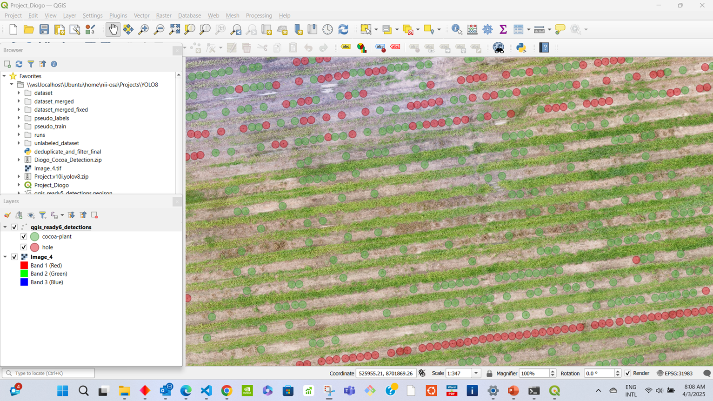
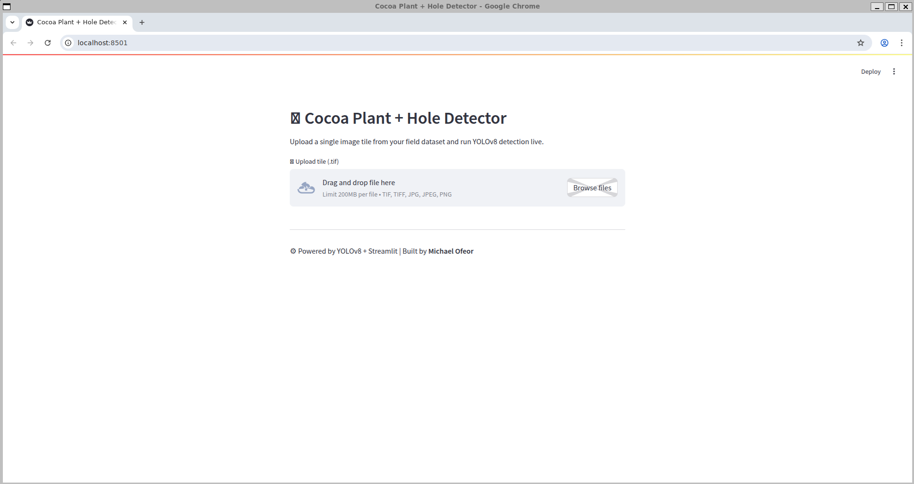
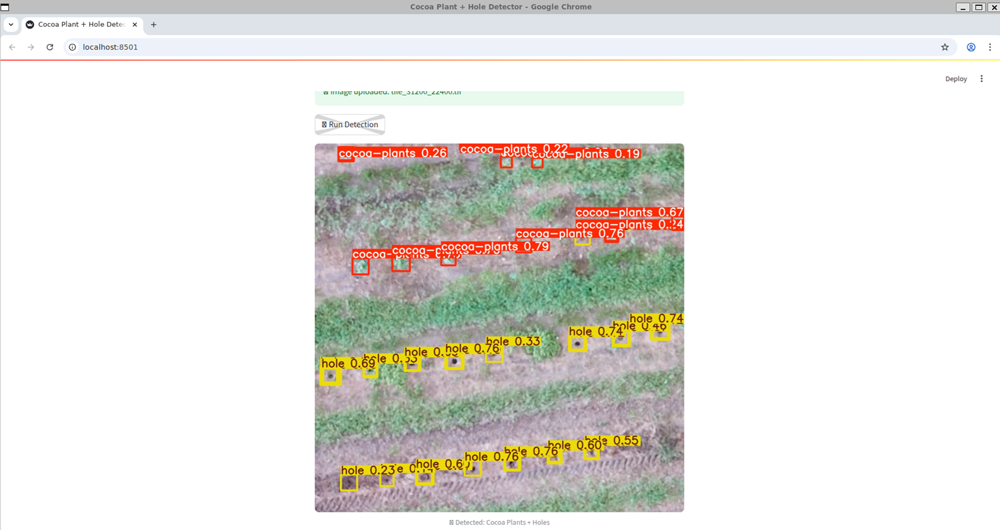
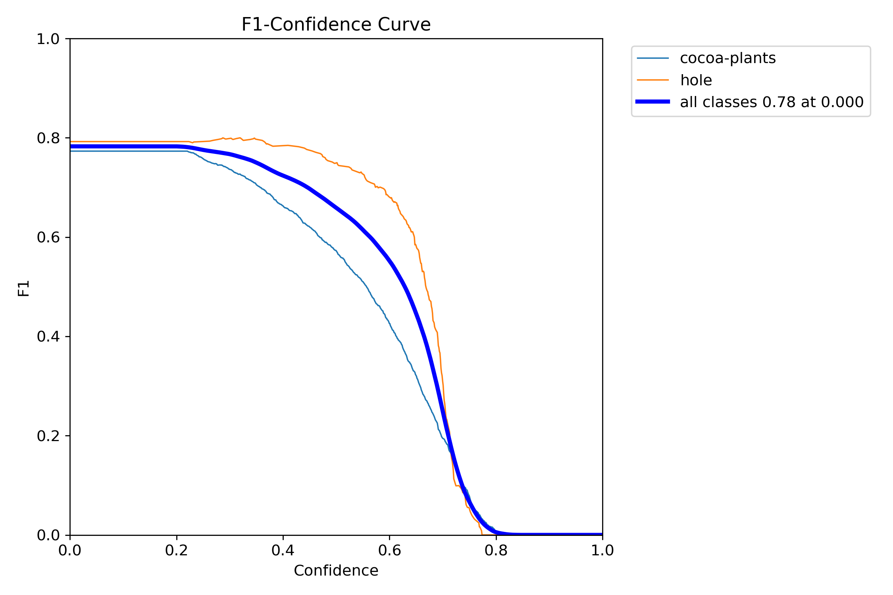
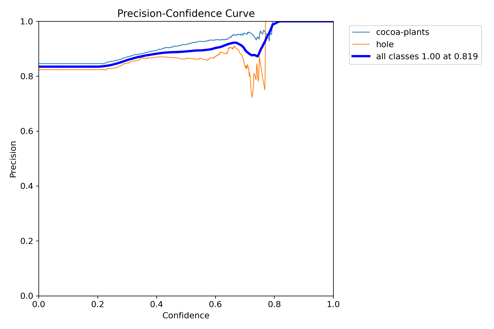
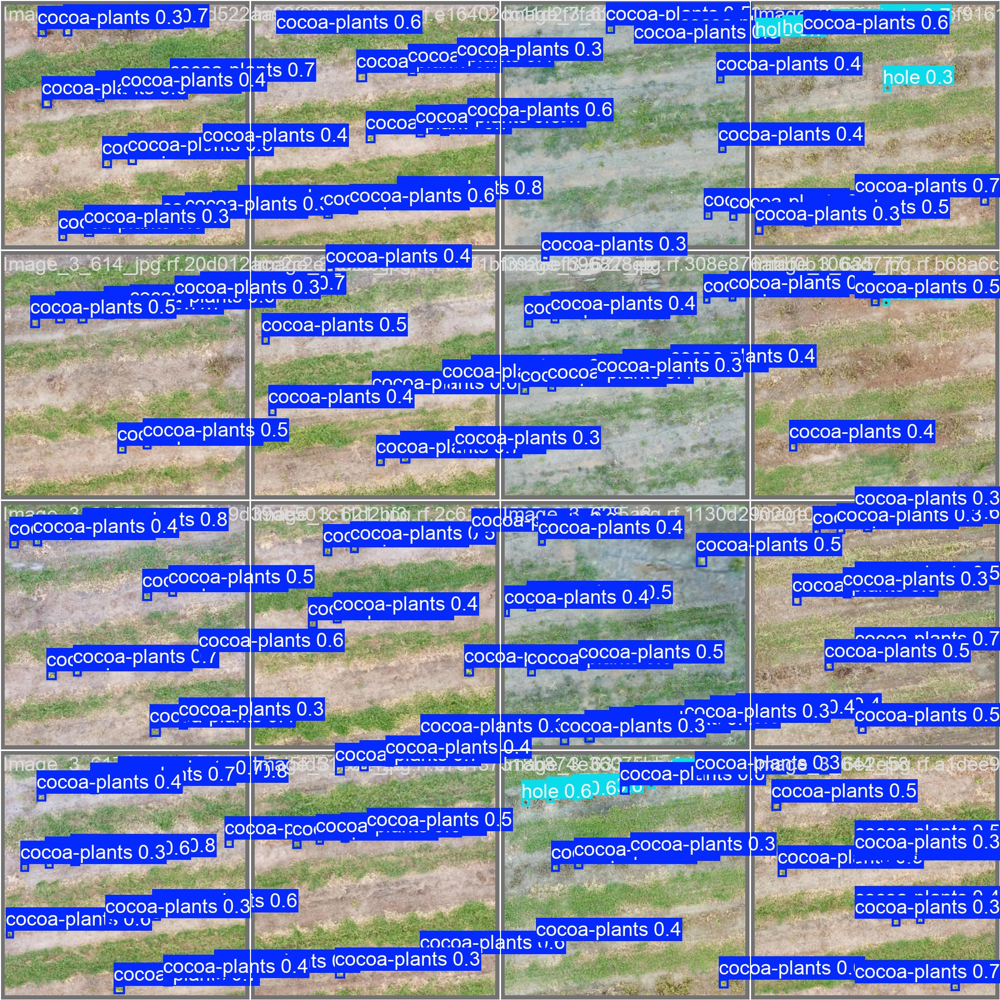
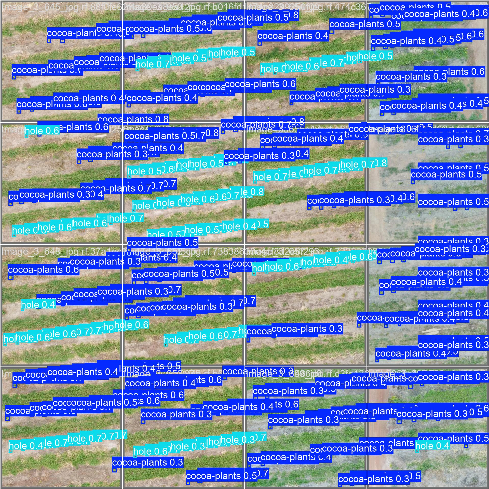

# 🌱 Cocoa Plant Detection + GIS Pipeline with YOLOv8 + Streamlit


[](https://cocoa-plant-detector.streamlit.app)
[](https://github.com/NiiOsa1/cocoa-plant-detector)

---

##  Table of Contents

- [Overview](#overview)
- [Project Structure](#project-structure)
- [Full Detection Pipeline](#full-detection-pipeline)
- [QGIS Integration](#qgis-integration)
- [Streamlit Web Demo](#streamlit-web-demo)
- [Command-Line Interface (CLI)](#command-line-interface-cli)
- [Geo-Referencing Details](#geo-referencing-details)
- [Dataset Notes](#dataset-notes)
- [Model Performance](#model-performance)
- [Reproducibility](#reproducibility)
- [Example Visuals](#example-visuals)
- [License](#license)
- [Maintainer](#maintainer)

---

## Demo Notebook

> 📌 **Note:** GitHub may truncate full notebook preview due to image-heavy output — download or open locally for complete view.

- [📓 Training, Inference, Mapping with YOLOv8](notebooks/CocoaPlant_YOLOv8_Training_QGIS_Deployment.ipynb)

---

##  Overview

This repository delivers a **production-ready AI pipeline** for detecting **cocoa plants and planting holes** from high-resolution aerial imagery using **YOLOv8** and **QGIS**.

It includes:

- 🧩 Tiling of large orthomosaic images
- 🧠 Batch object detection on tiles
- 🧭 Spatial deduplication and coordinate conversion
- 🗂️ GeoJSON/GPKG export for GIS tools

---

## 🚀 Features

- 🧱 Orthomosaic tiling with overlap
- 🧠 YOLOv8 CLI + Streamlit interface
- 🌍 GeoJSON/GPKG GIS-ready outputs
- 🎯 UTM coordinate conversion + deduplication
- 🧪 Notebook: training, inference, and QGIS integration


---

## 🧪 Installation

Clone the repo and install dependencies:

```bash
git clone https://github.com/NiiOsa1/cocoa-plant-detector.git
cd cocoa-plant-detector
pip install -r requirements.txt
```

---

## 🧠 Download Trained Model

You can download the trained YOLOv8s model from this [Google Drive link](https://drive.google.com/file/d/1-YJ9n4eoUO-JBcg4BYBmbogrA56F-9FN/view?usp=sharing).

Then place it in the expected path:
```
runs/cocoa_yolov8s_phase4_refined/weights/best.pt
```

💡 Tip: This is the exact path your inference script expects by default (weights_path = ...).

---

##  Project Structure

```plaintext
cocoa-plant-detector/
├── cocoa_cli_pipeline/         # CLI interface for tiling, inference, and geoconversion
│   ├── cli.py
│   ├── infer.py
│   ├── geoconvert.py
│   └── tiler.py
├── cocoa_pipeline_core/        # Core YOLOv8 + GIS logic
│   ├── tile_creator.py
│   ├── batch_infer_yolov8.py
│   └── deduplicate_and_filter.py
├── streamlit_app/              # Streamlit UI for live tile inference
│   └── app.py
├── notebooks/                  # Notebook for training, eval, and GIS overlay
│   └── CocoaPlant_YOLOv8_Training_QGIS_Deployment.ipynb
├── examples/                   # Visuals: metrics, detection samples, QGIS overlay
│   ├── val_batch0_pred.jpg
│   ├── val_batch1_pred.jpg
│   ├── F1_curve.png
│   ├── P_curve.png
│   ├── StreamlitApp.png
│   ├── StreamlitDetection.png
│   └── Final_QGIS_Output.png
├── test_data/                  # Sample tiles and labels for testing
│   └── tile_31200_22400.tif
├── README.md
├── requirements.txt
└── setup.py
```

---

##  Full Detection Pipeline

1. **🧱 Tile Large Aerial Image**
   ```bash
   python cocoa_pipeline_core/tile_creator.py
   ```

   Input: Image_4.tif

   Output: tiles1/ (1024×1024 px tiles with 22% overlap)

2. 🧠 YOLOv8 Batch Inference

   You can now run the inference script with your own tile folder like this:

   ```bash
   python cocoa_pipeline_core/batch_infer_yolov8.py \
   
     --tiles /path/to/your/tiles_folder \
     --output runs/your_output_folder
   ```
Example:
```
python cocoa_pipeline_core/batch_infer_yolov8.py \
  --tiles test_data/ \
  --output runs/test_output
```

  🔁 The script will automatically:

  Download best.pt from Google Drive if missing

  Predict on all .tif tiles in the folder

  Save detection labels and visual outputs


   Inference across all tiles

   Confidence: conf=0.22, IoU: 0.73

   Outputs YOLO .txt format


3. 🌍 Convert to GeoJSON/GPKG

   ```bash
   python cocoa_pipeline_core/deduplicate_and_filter.py
   ```
   python deduplicate_and_filter_final.py
 
   Converts to map-based UTM coordinates

   Deduplicates detections from overlapping tiles

   Saves:

   qgis_ready6_detections.geojson


## QGIS Integration

   This repo includes a ready-to-open QGIS project:

  📄 Project_Cocoa.qgz
 
   Includes:

   Image_4.tif as the basemap

   Pre-styled detection layer (holes + cocoa plants)

   Correct CRS, colors, symbology


  🚀 To use:
  Open QGIS (v3.28+ recommended)

  Load Project_Cocoa.qgz

  All layers and styles will auto-load 🎯


### 🗺️ GIS Integration Output

**Final Detection Overlay in QGIS**
Bounding boxes converted to UTM, deduplicated, and displayed on the original orthomosaic.




## 🚀 Streamlit Web Demo

A live demo is available to test cocoa plant and planting hole detection directly in your browser:

👉 [Launch the Streamlit App](https://cocoa-plant-detector.streamlit.app)

You can upload `.tif`, `.jpg`, or `.png` tiles and get YOLOv8-predicted outputs in real time — powered by the same model used in the pipeline.


### 🚀 Streamlit Demo

**Live Tile Prediction (via Streamlit)**
This tile was uploaded through the Streamlit UI and predicted live using the trained model.



**Predicted Detection Output**



## Command-Line Interface (CLI)

The full pipeline is also usable via a single terminal command. After installing the package with:

```bash
pip install .
 ```
You get access to:

```bash
cocoa-cli --help
 ```

Available Subcommands:

```
Command	      Description
tile	      Tile large aerial image
infer	      Run YOLOv8 batch inference
geoconvert    Convert YOLO labels to deduplicated GeoJSON
 ```

Example Usage:

```
 1. Tile large .tif image
cocoa-cli tile --input path/to/Image_4.tif --output tiles/

 2. Run batch inference
cocoa-cli infer --tiles tiles/ --weights weights/best.pt --output predictions/

 3. Convert YOLO txt → GeoJSON (deduplicated, GIS-ready)
cocoa-cli geoconvert --input predictions/ --output output.geojson

 ```

📌 Note: Please make sure your input paths exist before running. Use `test_data/` or your own orthomosaics.


## Geo-Referencing Details

  These values were extracted from the original orthomosaic (Image_4.tif) and used to convert pixel detections into map-based coordinates (UTM):

  ```
  Origin X      = 525765.6597     ← Upper-left X in UTM meters
  Origin Y      = 8702143.3199    ← Upper-left Y in UTM meters
  Pixel Width   = 0.01298099167   ← ~1.3 cm per pixel
  Pixel Height  = -0.01298099167  ← Negative = North-up
  ```

📌 Important: These values are dataset-specific.
Always extract your raster metadata when working with a different image.


## Dataset Notes

   ```
   Total training images: 1500

   1089 expertly labeled

   411 cleaned pseudo-labeled

   Classes:

   0 = cocoa-plant

   1 = hole
   ```

## Model Performance
 
   ```
| Set        | mAP@0.5 | Precision | Recall | F1 Score |
|------------|---------|-----------|--------|----------|
| Train      | 0.907   | 0.861     | 0.876  | 0.868    |
| Validation | 0.844   | 0.846     | 0.797  | 0.821    |
| Test       | 0.779   | 0.835     | 0.738  | 0.784    |

   ```

✅ Model: YOLOv8s (22.6MB)

⚡ Fast inference: ~16ms per image

🎯 Balanced detection for both classes

🔒 No signs of overfitting despite small dataset


## Reproducibility

Run the pipeline locally:


 1. Tile image
python cocoa_pipeline_core/tile_creator.py

 2. Run inference
python cocoa_pipeline_core/batch_infer_yolov8.py

 3. Convert & deduplicate
python cocoa_pipeline_core/deduplicate_and_filter.py

 Optional: Streamlit UI
streamlit run streamlit_app/app.py


---

## Example Visuals

Here’s a quick walkthrough of the pipeline in action:

A few visual highlights from model performance and predictions:

### 📊 Training Metrics & Model Behavior

**F1 Score vs Confidence**  


**Precision vs Confidence**  


---

### 🧠 Sample Predictions on Validation Tiles

**Sample Prediction – val_batch0**  


**Sample Prediction – val_batch1**  


---

## 🧪 Try It Yourself

Want to test the pipeline locally with included sample tiles?

```bash
streamlit run streamlit_app/app.py
```
Upload from test_data/ and see the same prediction pipeline running on your machine.

## License
This repository is licensed under the MIT License.
You’re free to use, modify, and distribute — with credit to the author.


## Maintainer 

Michael Mensah Ofeor
🔗 GitHub – @NiiOsa1
📩 michaelofeor2011@yahoo.com


⚡ Built for real-world cocoa analysis.
Powered by geospatial logic, YOLOv8, and a deep love for clean AI pipelines.


